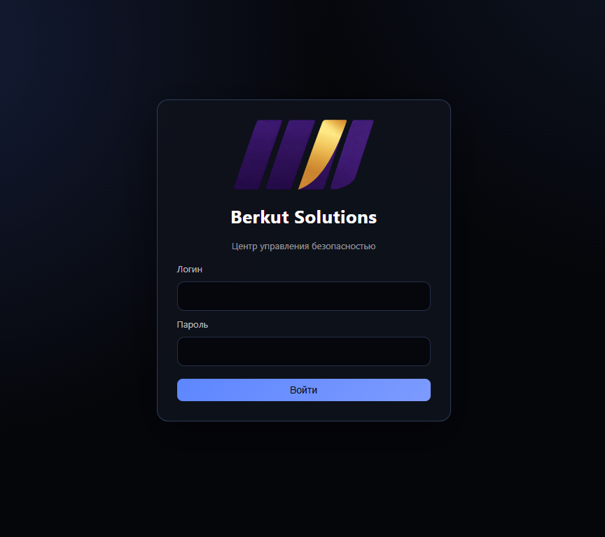
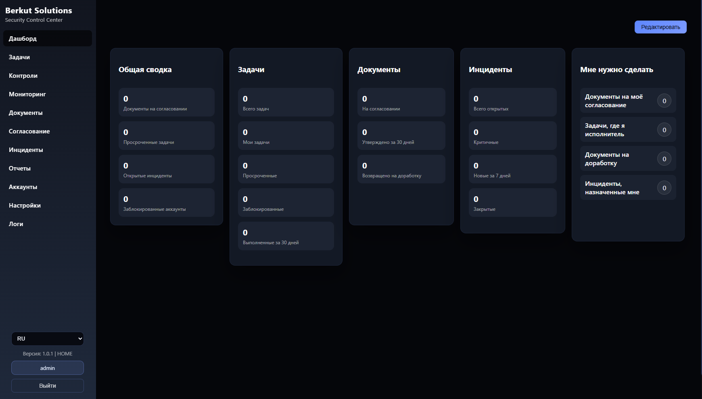
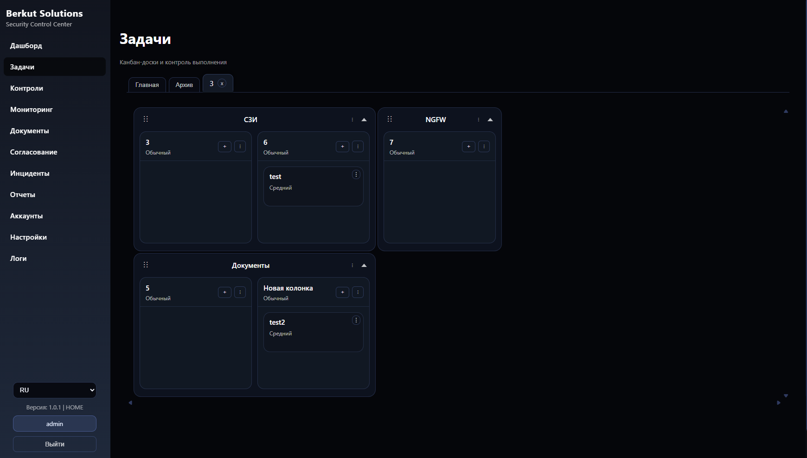

# Berkut Solutions - Security Control Center

<p align="center">
  
</p>

[English version](README.en.md)

Berkut Solutions - Security Control Center — self-hosted платформа управления безопасностью и соответствием требованиям, реализованная как Go-монолит со встроенным UI.

Актуальная версия: `1.0.3`

Ключевые принципы:
- zero-trust проверки прав сервером на каждом endpoint
- локальное развёртывание без внешних CDN-зависимостей
- аудит критичных операций
- предсказуемая эксплуатация через Docker/Docker Compose и CI

## Что входит в платформу
- Документы, согласования и шаблоны
- Инциденты и отчётность
- Задачи (spaces/boards/tasks)
- Мониторинг, SLA и уведомления
- Управление пользователями, ролями и группами
- Аудит действий

## Текущая архитектура
- Backend: Go `1.23`
- БД: PostgreSQL (production runtime)
- Миграции: `goose`
- Конфигурация: `cleanenv` + `config/app.yaml` + ENV
- RBAC: Casbin
- UI: встроенные статические ассеты (`gui/static`), RU/EN i18n
- Роутинг: модульный стек `chi`

## Быстрый старт
```bash
cp .env.example .env
docker compose up -d --build
```

Открыть: `http://localhost:8080`

## Полезные команды
Применить миграции (явно, отдельно от запуска приложения):
```bash
make migrate
```

Перезапуск стека:
```bash
docker compose down
docker compose up -d --build
```

Полное пересоздание данных (деструктивно):
```bash
docker compose down -v
docker compose up -d --build
```

Логи:
```bash
docker compose logs -f berkut
docker compose logs -f postgres
```

## Конфигурация
- `.env` — рабочий env-файл
- `.env.example` — шаблон
- `config/app.yaml` — базовый конфиг приложения
- `docker-compose.yaml` — основной compose-стек
- `docker/Dockerfile` — образ приложения

Обязательные секреты для non-dev:
- `CSRF_KEY`
- `PEPPER`
- `DOCS_ENCRYPTION_KEY`
- `BACKUP_ENCRYPTION_KEY` (или `BERKUT_BACKUP_ENCRYPTION_KEY`)

## Бэкапы (.bscc)
- Каталог бэкапов: `BERKUT_BACKUP_PATH` (по умолчанию: `data/backups`, в контейнере обычно `/app/data/backups`).
- Формат: один зашифрованный файл `.bscc` (manifest + checksums + db dump).
- В non-dev обязателен ключ шифрования: `BACKUP_ENCRYPTION_KEY`/`BERKUT_BACKUP_ENCRYPTION_KEY`.
- Поддерживаются: create/import/download/delete, dry-run/restore с прогрессом, maintenance mode, автобэкапы и retention.
- Ручной запуск поддерживает параметры: `label`, `scope`, `include_files`.
- Расписание поддерживает пресеты: ежедневно, еженедельно, ежемесячно (начало/конец месяца).

Основные ENV:
- `BERKUT_BACKUP_PATH` — путь хранения бэкапов.
- `BERKUT_BACKUP_PGDUMP_BIN` — путь к `pg_dump` (по умолчанию `pg_dump`).
- `BERKUT_BACKUP_MAX_PARALLEL` — максимум параллельных backup jobs.
- `BERKUT_BACKUP_UPLOAD_MAX_BYTES` — лимит upload для import `.bscc`.

Ручное создание бэкапа (API):
```bash
curl -X POST http://localhost:8080/api/backups \
  -H "Cookie: berkut_session=..." \
  -H "X-CSRF-Token: ..."
```

Восстановление:
- Dry-run: `POST /api/backups/{id}/restore/dry-run`
- Реальное восстановление: `POST /api/backups/{id}/restore`
- Прогресс: `GET /api/backups/restores/{restore_id}`

Maintenance mode:
- Во время реального restore система переводится в maintenance mode.
- Обычные API возвращают `503`, статус restore остаётся доступен.
- После завершения restore режим обслуживания отключается.

Docker Compose заметка:
- Храните volume `berkut_data` (в нём `DATA_PATH`, включая `BACKUP_PATH`) и `berkut_pgdata`.

## Мониторинг и SLA
- Вкладки мониторинга: `/monitoring`, `/monitoring/events`, `/monitoring/sla`, `/monitoring/maintenance`, `/monitoring/certs`, `/monitoring/notifications`, `/monitoring/settings`.
- SLA рассчитывается с учетом покрытия данных (coverage-aware), с окнами `24h/7d/30d`.
- Закрытые периоды `day/week/month` оцениваются background evaluator-джобой (асинхронно).
- SLA-инцидент создается только при закрытии выбранного периода и только если включена policy монитора.
- Для техобслуживания доступны действия: планирование, редактирование, остановка и удаление окон.
- API техобслуживания: `GET/POST/PUT/DELETE /api/monitoring/maintenance`, `POST /api/monitoring/maintenance/{id}/stop`.

### Техобслуживание
- Страница техобслуживания: `/monitoring/maintenance`, вкладка находится рядом с SLA.
- Планировщик поддерживает стратегии `single`, `cron`, `interval`, `weekday`, `monthday`.
- Для каждой записи задаются: название, markdown-описание, затронутые мониторы, часовой пояс, временные границы.
- Окна техобслуживания трактуются как accepted risk: при расчете SLA эти интервалы исключаются из штрафа за недоступность.
- Доступны операции lifecycle: создать, изменить, остановить досрочно, удалить.

## Разработка и проверки
```bash
make ci
```

Сборка с переопределением версии (опционально):
```bash
go build -ldflags "-X 'berkut-scc/core/appmeta.AppVersion=1.0.3'" ./...
```

Доступные цели:
```bash
make fmt
make fmt-check
make vet
make test
make lint
make migrate
```

## Документация
- Общий индекс: `docs/README.md`
- Русская документация: `docs/ru/README.md`
- English docs: `docs/eng/README.md`
- RU Backups: `docs/ru/backups.md`
- EN Backups: `docs/eng/backups.md`

## Безопасность
- Не используйте default-secrets вне dev.
- Проверка прав выполняется сервером для каждого endpoint.
- Ограничивайте `BERKUT_SECURITY_TRUSTED_PROXIES` только доверенными адресами.
- Используйте TLS-терминацию на reverse proxy в production.
- Не храните ключи (`BACKUP_ENCRYPTION_KEY`, `DOCS_ENCRYPTION_KEY`, `PEPPER`, `CSRF_KEY`) в git.

## Скриншоты



