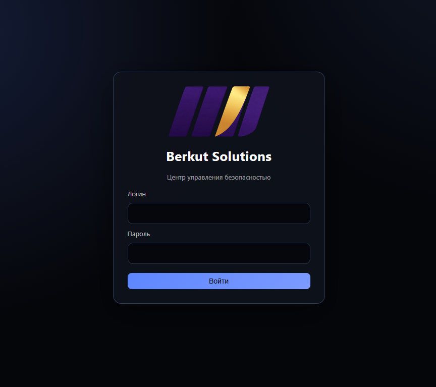
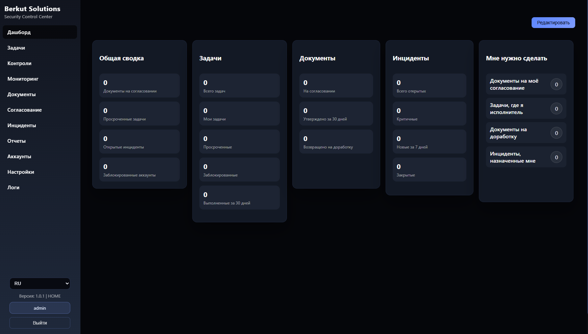
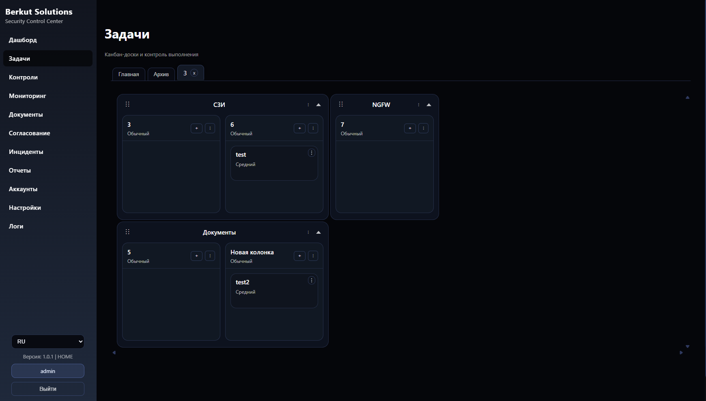

# Berkut Solutions - Security Control Center

  

[English version](README.en.md)

Berkut Solutions - Security Control Center (SCC) — self-hosted платформа для управления безопасностью и соответствием требованиям.

Актуальная версия: `1.1.5`

## Проверка состояния и совместимость вкладок (1.0.12)

- После успешного входа (и после смены пароля при первом логине) доступна **одноразовая** страница проверки: `/healthcheck`.
- Она выполняет базовые health-пробы (сессия/права/доступность ключевых endpoints) и показывает отчёт совместимости вкладок (Compat) **без авто-миграций**.
- Если есть `needs_attention`/`incompatible`, при входе появляется мастер совместимости: только ручные действия (Partial adapt / Full reset) через jobs с прогрессом и двойным подтверждением для destructive-операций.

## Что это за продукт

Berkut SCC — единая рабочая среда для ИБ-подразделения, где операционные процессы, контрольные процедуры и артефакты соответствия ведутся в одной системе.

Платформа помогает уйти от разрозненных таблиц, почты и «ручного» статуса задач: документы, инциденты, контрольные активности и мониторинг становятся связанными между собой и управляются по единым правилам доступа.

## Для кого подходит

- Компании, которым нужен self-hosted контур и контроль над чувствительными данными.

- ИБ-команды, объединяющие комплаенс, инцидент-менеджмент и операционную работу.

- Организации, где важны аудит действий, воспроизводимость процессов и предсказуемый деплой.

- Команды, которым нужен рабочий инструмент «здесь и сейчас», без внешних SaaS-зависимостей.

## Что дает компании

- Повышает управляемость ИБ-процессов за счет единой платформы и прозрачной ответственности.

- Сокращает операционные риски: меньше «потерянных» задач, версий документов и неучтенных изменений.

- Ускоряет подготовку к внутренним и внешним проверкам благодаря аудиту и структурированным данным.

- Снижает зависимость от внешней инфраструктуры и публичных облаков.

## Функциональные возможности

- Документы и согласования:

  хранение, версияция, совместная работа и редактирование через OnlyOffice.

- Инциденты:

  регистрация, сопровождение, связка с документами и контрольными действиями.

- Мониторинг и SLA:

  события, метрики доступности, политика SLA и окна техобслуживания.

- Диагностика движка мониторинга (1.0.12):

  `Engine stats` (inflight/due/skipped, p95 ожидания/длительности, распределение ошибок) + устойчивость к сетевым флапам (jitter + scheduled retries без `sleep` в слоте).

- Автоматизация мониторинга:

  per-monitor правила создания инцидентов/задач при недоступности и TLS-рисках.

- Центр уведомлений мониторинга:

  quiet hours, шаблоны сообщений и история доставок с подтверждением.

- Очистка данных в Settings:

  выборочная очистка модулей с внутренним подтверждением и отчётом по удалённым данным.

- Задачи:

  рабочие пространства, доски, карточки, комментарии, связи и сроки.

- Управление доступом:

  пользователи, роли, группы, разграничение прав на серверной стороне.

- Бэкапы:

  encrypted `.bscc` архивы, импорт/восстановление, планирование и retention.

## Безопасность по дизайну

- Server-side zero-trust проверки прав на каждом endpoint.

- Аудит критичных действий и событий платформы.

- Изоляция данных в вашем контуре (self-hosted модель).

- Встроенный UI без внешних CDN-зависимостей.

- Поддержка reverse-proxy/TLS для production-сценариев.

## Технический профиль

- Backend: Go (`chi`, `cleanenv`, `goose`).

- Database: PostgreSQL.

- RBAC: Casbin.

- Deployment: Docker / Docker Compose.

## Observability (1.1.5)

- Liveness: `GET /healthz`
- Readiness (DB ping): `GET /readyz`
- Prometheus метрики: `GET /metrics` (по умолчанию выключено; включение через `BERKUT_METRICS_ENABLED=true`, опционально защищается `BERKUT_METRICS_TOKEN`)

## Auth (1.1.5)

- 2FA (TOTP) + recovery codes (включается пользователем в Settings).
- Passkeys (WebAuthn): вход по ключу доступа и подтверждение 2FA через passkey (KeePassXC, Windows Hello и т.д.).
- Подтверждение 2FA вынесено на отдельную страницу: `/login/2fa` (для совместимости с менеджерами паролей).

## Документация

- Общий индекс: [`docs/README.md`](docs/README.md)

- Русская документация: [`docs/ru/README.md`](docs/ru/README.md)

- English docs: [`docs/eng/README.md`](docs/eng/README.md)
- Шаблон message уведомлений мониторинга: [`docs/ru/monitoring_notifications_message_template.md`](docs/ru/monitoring_notifications_message_template.md)
- Проверка состояния (/healthcheck): [`docs/ru/healthcheck.md`](docs/ru/healthcheck.md)

## Запуск и деплой

- Быстрый запуск: [`QUICKSTART.md`](QUICKSTART.md)

- Деплой и CI/CD: [`docs/ru/deploy.md`](docs/ru/deploy.md)

- Runbook (запуск/восстановление): [`docs/ru/runbook.md`](docs/ru/runbook.md)

- HTTPS + OnlyOffice: [`docs/ru/https_onlyoffice.md`](docs/ru/https_onlyoffice.md)

- Пример reverse-proxy compose: [`docs/ru/docker-compose.https.yml`](docs/ru/docker-compose.https.yml)

## Безопасность

- Не используйте default-secrets вне dev.

- Не храните ключи в git (`BACKUP_ENCRYPTION_KEY`, `DOCS_ENCRYPTION_KEY`, `PEPPER`, `CSRF_KEY`).

- Ограничивайте `BERKUT_SECURITY_TRUSTED_PROXIES` только доверенными адресами.

- Для единого времени в UI и контейнерах задавайте `TZ=Europe/Moscow` (или вашу рабочую таймзону) в compose/.env.

## Скриншоты

